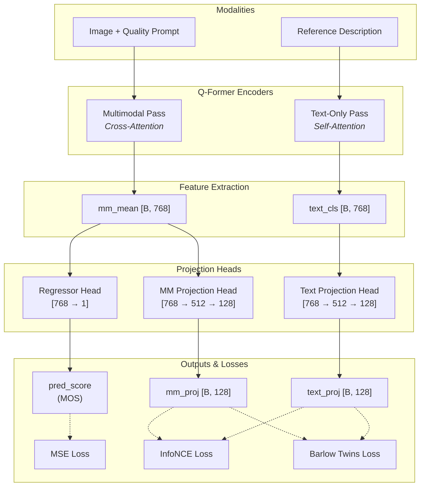

# Dual-Branch Contrastive Q-Former Architecture

This document explains the architecture of the Q-Former model optimized for Test-Time Adaptation (TTA) via Contrastive Learning. This architecture is designed to map visual/multimodal features and purely textual semantic features into a shared representation space, preventing dimensional collapse while maintaining high correlation with human perception.

## Architecture Diagram

---

## Component Breakdown

### 1. Dual Encoding Branches
To perform contrastive learning, the architecture splits the input processing into two distinct forward passes through the frozen BLIP-2 components and the trainable Q-Former:

*   **Multimodal (MM) Branch:** Takes the test image (passed through the frozen ViT) and a generic quality prompt (e.g., "Describe the quality of this image"). It outputs a sequence of 32 query tokens, which are averaged into a single vector `mm_mean [B, 768]`.
*   **Text (Desc) Branch:** Takes an expert-generated or LLM-generated high-quality textual description of the image. It processes this as pure text through the Q-Former, grabbing the `[CLS]` token to produce `text_cls [B, 768]`.

### 2. Task-Specific Heads
The raw `[B, 768]` features are routed to three specialized multi-layer perceptrons (MLPs):

*   **Quality Regressor (`regressor`):** Maps the visual `mm_mean` directly to a single scalar (`pred_score`), which is supervised by the MSE loss against human Mean Opinion Scores (MOS).
*   **Multimodal Projection Head (`mm_head`):** Projects the `mm_mean` down into a lower-dimensional embedding space `[B, 128]`. It uses a hidden layer of size 512 with BatchNorm and ReLU.
*   **Text Projection Head (`text_head`):** Independently projects the `text_cls` down to the same `[B, 128]` embedding space.

*(Note: These separate projection heads are crucial. By forcing the 768-D vectors through an informational bottleneck with non-linearities, we prevent the model from short-circuiting the contrastive loss.)*

### 3. The Objective Functions
The model optimizes a joint loss function $L_{Total} = L_{MSE} + L_{InfoNCE} + \lambda L_{BarlowTwins}$

*   **Mean Squared Error (MSE):** Ensures the primary task—predicting the numerical quality score—remains accurate.
*   **InfoNCE (NT-Xent):** A symmetric contrastive loss applied to `mm_proj` and `text_proj`. It pulls the matching Image/Description pairs closely together in the 128-D space while pushing all other mismatching pairs in the batch apart. 
*   **Barlow Twins (BT):** Operates on the cross-correlation matrix between `mm_proj` and `text_proj`. It forces the diagonal to 1 (invariance) and the off-diagonals to 0 (redundancy reduction). This explicitly prevents **dimensional collapse**, ensuring that every one of the 128 dimensions learns a unique, independent semantic feature (e.g., one dimension might track blur, another tracks lighting).

### 4. Why this matters for TTA
By pre-training with this architecture, we guarantee that the visual features and the text features share a highly structured, non-collapsed manifold. During Test-Time Adaptation, we can confidently freeze the model, retrieve nearest-neighbor text features, and use cosine similarity to "pull" the visual features to their correct location on the manifold, drastically improving zero-shot and out-of-distribution performance.
