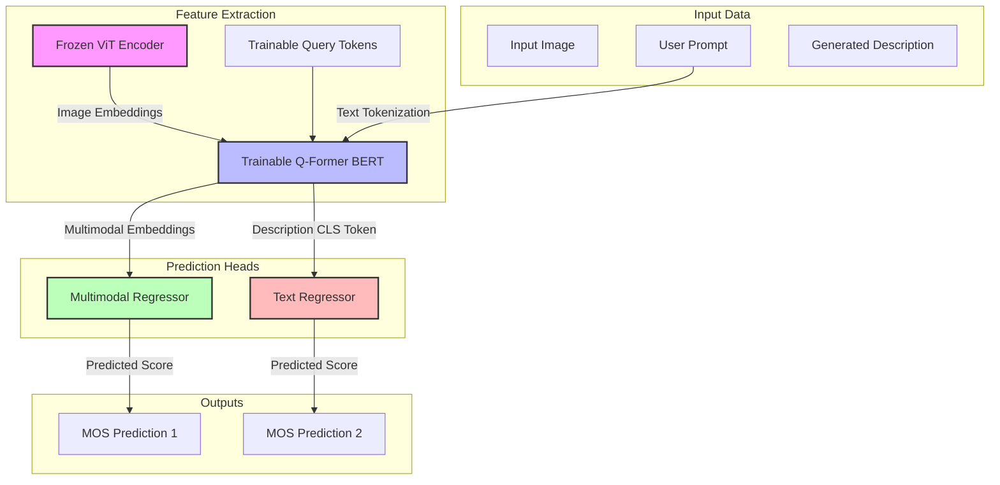

# Comprehensive Analysis: BLIP-2 Q-Former Pretraining & Description Regularization

This document provides a highly detailed explanation of the three PyTorch pretraining scripts located in this workspace. These scripts are designed for **Image Quality Assessment (IQA)** and **Mean Opinion Score (MOS)** prediction using the **BLIP-2 Q-Former** architecture trained on the **EvalMI** dataset.

---

## 🗺️ High-Level Architectural Overview

At their core, these scripts fine-tune a **BLIP-2 Q-Former (Querying Transformer)** to extract rich visual-semantic features and map them to human-assessed quality scores. 



---

## 📂 File-by-File Technical Deep Dive

### 1. `baseline_qformer.py`
This script implements the **baseline supervised model**. It maps multimodal image-prompt combinations directly to a human Quality Score (MOS).

* **How it works:**
  1. The input image is passed through a **frozen Vision Transformer (ViT)** to produce frozen patch embeddings.
  2. Trainable **query tokens** (32 tokens of dimension 768) are combined with the tokenized user **prompt** and the frozen image embeddings.
  3. These are fed together into the **Q-Former (BERT)** block using cross-attention (the *multimodal pass*).
  4. The 32 output query tokens are pooled using a simple **mean pool** operation to get a single $1 \times 768$ representation (`mm_mean_embeds`).
  5. An MLP **Regressor** (`Linear(768 -> 256) -> ReLU -> Linear(256 -> 1)`) maps the representation to a single real-valued quality score.
  6. **Crucially:** It completely ignores the MLLM-generated description (`gen_answer`) during training and inference.

* **Loss Formulation:** 
  $$\mathcal{L} = \text{MSE}(\hat{y}_{\text{mm}}, y)$$
  *Where $\hat{y}_{\text{mm}}$ is the regressor's output, and $y$ is the ground-truth MOS score.*

---

### 2. `qformer+regularization_mllm.py`
This script introduces **Description Regularization** using high-quality descriptions generated by the **Qwen-VL3 MLLM** (Multimodal Large Language Model).

* **The Concept of Description Regularization:**
  If a model understands the qualitative degradation of an image (e.g., "The image is blurry and has heavy compression artifacts"), its internal representation of the text description should also correlate with the low quality score. By training the Q-Former's text branch to predict the quality score directly from the text description, we align its visual-text latent space with human quality judgments.

* **How it works:**
  This script employs a **dual-branch training paradigm**:
  1. **Multimodal Branch (Same as Baseline):**
     * Input: Image + Prompt $\rightarrow$ Q-Former $\rightarrow$ Mean Pool $\rightarrow$ `regressor_mm` $\rightarrow$ $\hat{y}_{\text{mm}}$.
  2. **Description Text Branch (New):**
     * Input: Tokenized generated description (`descs`).
     * The description is passed through the Q-Former in **text-only mode** (without visual features).
     * The representation at the first token index (the `[CLS]` token) is extracted: `text_cls = text_out.last_hidden_state[:, 0, :]`.
     * This `[CLS]` embedding is mapped through a trainable projection layer `self.model.text_proj` to obtain `text_feats` ($1 \times 256$).
     * An independent text MLP **Regressor** (`Linear(256 -> 128) -> ReLU -> Linear(128 -> 1)`) maps these text features to a quality score: $\hat{y}_{\text{text}}$.

* **Loss Formulation:**
  $$\mathcal{L} = \text{MSE}(\hat{y}_{\text{mm}}, y) + \text{MSE}(\hat{y}_{\text{text}}, y)$$
  *By minimizing the joint loss, the Q-Former's text encoder and `text_proj` learn to extract quality-informed semantics from the descriptive text, while the Q-Former's multimodal queries align visual and text prompt contexts.*

---

### 3. `qformer+regularization_pt1.py`
This script is structurally and architecturally **identical** to `qformer+regularization_mllm.py`. The key distinction lies in the **source of the description data** used during pretraining.

* **What is different?**
  * Rather than using Qwen-VL3, it trains the description regularization branch using text descriptions generated by the **Qinstruct** MLLM.
  * Qinstruct is specifically fine-tuned to describe image quality, distortions, and visual anomalies. Using it allows the text branch to regularize the Q-Former using highly specific quality-centric language rather than generic image captions.

---

## 📊 Comprehensive Comparison Matrix

| Feature / Dimension | `baseline_qformer.py` | `qformer+regularization_mllm.py` | `qformer+regularization_pt1.py` |
| :--- | :--- | :--- | :--- |
| **Methodology** | Standard Supervised Multimodal Regression | Supervised Regression + MLLM Description Regularization | Supervised Regression + Qinstruct Description Regularization |
| **Description Source** | *Ignored / Unused* | **Qwen-VL3 MLLM** | **Qinstruct MLLM** (PT1) |
| **Data Path (Train)** | `evalmi_train_full_gen_responses_PT1.csv` | `evalmi_train_qwenvl3_full_gen_responses_pretrained.csv` | `evalmi_train_full_qinstruct_descriptions.csv` |
| **Data Path (Val / Test)** | `evalmi_val_full_gen_responses_PT1.csv` | `evalmi_val_full_gen_responses_MLLM.csv` | `evalmi_val_full_gen_responses_MLLM.csv` |
| **Forward Pass Modes** | Multimodal Pass only | Multimodal Pass + Text-Only Pass | Multimodal Pass + Text-Only Pass |
| **Regressors** | Single MLP (`regressor`) | Dual MLPs (`regressor_mm` + `regressor_text`) | Dual MLPs (`regressor_mm` + `regressor_text`) |
| **Trainable Layers** | Q-Former BERT + Query Tokens + Regressor | Q-Former BERT + Query Tokens + **text_proj** + Regressor MM + Regressor Text | Q-Former BERT + Query Tokens + **text_proj** + Regressor MM + Regressor Text |
| **Loss Function** | $\text{MSE}(\hat{y}_{\text{mm}}, y)$ | $\text{MSE}(\hat{y}_{\text{mm}}, y) + \text{MSE}(\hat{y}_{\text{text}}, y)$ | $\text{MSE}(\hat{y}_{\text{mm}}, y) + \text{MSE}(\hat{y}_{\text{text}}, y)$ |
| **Optimizer** | `Adam` | `AdamW` | `AdamW` |
| **Output Checkpoint** | `evalmi_baseline_qf_ver2.pth` | `evalmi_qf_desc_reg_mllm_qwen3vl.pth` | `evalmi_qf_desc_reg_qinstruct.pth` |

---

## 🛠️ Deep Dive: The Code Blocks Compared

### 1. Model Wrapper Forward Passes
Let's contrast the core forward architectures in PyTorch code. Notice how the regularized version adds a secondary text projection path.

#### A. Baseline Wrapper Forward (`baseline_qformer.py`)
```python
def forward(self, images, prompts, descs):
    B = images.size(0)
    images = images.to(self.device)

    # 1. Vision Encoder Pass
    with torch.no_grad():
        with self.model.maybe_autocast():
            image_embeds_frozen = self.model.ln_vision(self.model.visual_encoder(images))
        image_embeds_frozen = image_embeds_frozen.float()
        image_atts = torch.ones(image_embeds_frozen.size()[:-1], dtype=torch.long, device=self.device)

    # 2. Multimodal Q-Former Pass (image + prompt text)
    query_tokens = self.model.query_tokens.expand(B, -1, -1)
    text_prompt = self.model.tokenizer(prompts, return_tensors="pt", padding=True, truncation=True).to(self.device)
    query_atts = torch.ones(query_tokens.size()[:-1], dtype=torch.long, device=self.device)
    mm_attention_mask = torch.cat([query_atts, text_prompt.attention_mask], dim=1)

    mm_out = self.model.Qformer.bert(
        text_prompt.input_ids,
        query_embeds=query_tokens,
        attention_mask=mm_attention_mask,
        encoder_hidden_states=image_embeds_frozen,
        encoder_attention_mask=image_atts,
        return_dict=True,
    )
    mm_query_embeds = mm_out.last_hidden_state[:, : query_tokens.size(1), :]
    mm_mean_embeds = mm_query_embeds.mean(dim=1) # [B, 768]

    return mm_mean_embeds
```

#### B. Regularized Wrapper Forward (`qformer+regularization_mllm.py` & `qformer+regularization_pt1.py`)
```python
def forward(self, images, prompts, descs):
    B = images.size(0)
    images = images.to(self.device)

    # 1. Vision Encoder Pass
    with torch.no_grad():
        with self.model.maybe_autocast():
            image_embeds_frozen = self.model.ln_vision(self.model.visual_encoder(images))
        image_embeds_frozen = image_embeds_frozen.float()
        image_atts = torch.ones(image_embeds_frozen.size()[:-1], dtype=torch.long, device=self.device)

    # 2. Text-Only Pass on generated descriptions (descs)
    query_tokens = self.model.query_tokens.expand(B, -1, -1)
    text_desc = self.model.tokenizer(descs, return_tensors="pt", padding=True, truncation=True).to(self.device)
    text_out = self.model.Qformer.bert(
        text_desc.input_ids,
        attention_mask=text_desc.attention_mask,
        return_dict=True,
    )
    text_cls = text_out.last_hidden_state[:, 0, :]   # CLS token [B, 768]
    text_feats = self.model.text_proj(text_cls)       # projected [B, 256]

    # 3. Multimodal Q-Former Pass (image + prompt text)
    text_prompt = self.model.tokenizer(prompts, return_tensors="pt", padding=True, truncation=True).to(self.device)
    query_atts = torch.ones(query_tokens.size()[:-1], dtype=torch.long, device=self.device)
    mm_attention_mask = torch.cat([query_atts, text_prompt.attention_mask], dim=1)

    mm_out = self.model.Qformer.bert(
        text_prompt.input_ids,
        query_embeds=query_tokens,
        attention_mask=mm_attention_mask,
        encoder_hidden_states=image_embeds_frozen,
        encoder_attention_mask=image_atts,
        return_dict=True,
    )
    mm_query_embeds = mm_out.last_hidden_state[:, : query_tokens.size(1), :]
    mm_mean = mm_query_embeds.mean(dim=1)            # [B, 768]

    return text_feats.float(), mm_mean.float()
```

### 2. Loss Optimization Logic
Notice the difference in how the parameters are optimized and how losses are aggregated:

**In `baseline_qformer.py`:**
```python
mm_mean_embeds = qformer(images, prompts, descs)
pred = regressor(mm_mean_embeds).squeeze(-1)
reg_loss = reg_criterion(pred, gt_scores)
loss = reg_loss
```

**In `qformer+regularization_mllm.py` & `qformer+regularization_pt1.py`:**
```python
text_feat, mm_mean_embeds = qformer(images, prompts, descs)
pred_mm = regressor_mm(mm_mean_embeds).squeeze(-1)
pred_text = regressor_text(text_feat).squeeze(-1)

# Combined loss regularizes the representation space
reg_loss = reg_criterion(pred_mm, gt_scores) + reg_criterion(pred_text, gt_scores)
loss = reg_loss
```

---

## 📈 Metric Evaluation: Spearman Rank Correlation Coefficient (SRCC)
All three scripts evaluate using a custom NumPy implementation of the **Spearman Rank Correlation Coefficient (SRCC)**. 

Since standard PyTorch doesn't natively include a differentiable or fast rank-order metric, a NumPy-only equivalent of `scipy.stats.rankdata(method="average")` and `scipy.stats.spearmanr` is implemented:
* **`rankdata_numpy`**: Converts continuous predicted and ground-truth values into discrete ordinal ranks (supporting tie-breaks by averaging).
* **`spearmanr_numpy`**: Computes standard Pearson correlation over these generated ranks.

During evaluation, the script tracks validation SRCC. When validation SRCC achieves a new high, the best models are evaluated on the test set, and predictions are saved as CSV outputs.

---

## 🚀 Execution & Model Checkpointing

Each script outputs a custom PyTorch `.pth` checkpoint and a predicted test CSV file containing:
* `image_name`
* `prompt`
* `gen_answer` (generated description)
* `gt_score` (ground truth quality score)
* `pred_score` / `pred_mm_score` + `pred_text_score` (predictions)

### Where checkpoints are saved:
* **Baseline Q-Former:** `/home/rajivs/anatapmitra/anatap_data/Qformer_experiments/new_pretraining/evalmi_baseline_qf_ver2.pth`
* **MLLM QwenVL3 Regularization:** `/home/rajivs/anatapmitra/anatap_data/Qformer_experiments/new_pretraining/evalmi_qf_desc_reg_mllm_qwen3vl.pth`
* **Qinstruct (PT1) Regularization:** `/home/rajivs/anatapmitra/anatap_data/Qformer_experiments/new_pretraining/evalmi_qf_desc_reg_qinstruct.pth`
