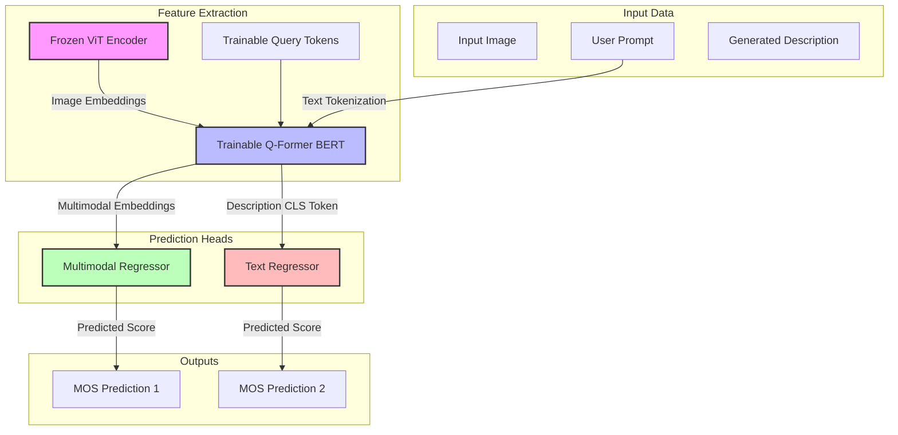

# Comprehensive Analysis: BLIP-2 Q-Former Pretraining, Description Regularization & Low-Data Adaptation

This document provides a highly detailed explanation of the five PyTorch training scripts located in this workspace. These scripts are designed for **Image Quality Assessment (IQA)**, **Mean Opinion Score (MOS)** prediction, and **Human Preference Comparison** using the **BLIP-2 Q-Former** architecture.

---

## 🗺️ High-Level Architectural Overview

At their core, these scripts fine-tune or pretrain a **BLIP-2 Q-Former (Querying Transformer)** to extract rich visual-semantic features. The scripts fall into two primary architectural paradigms:

### Paradigm A: Absolute Quality (MOS) Regression
Used in `baseline_qformer.py`, `qformer+regularization_mllm.py`, `qformer+regularization_pt1.py`, and `A20k.py`. This paradigm maps input image-prompt combinations directly to a continuous human quality score.



### Paradigm B: Siamese Pairwise Preference Learning
Used in `Hpd_10pct.py`. Instead of absolute scores, it models relative preference between two candidate images given a shared prompt.

```mermaid
graph TD
    subgraph Input Pair
        Img1[Image 1]
        Img2[Image 2]
        P[Shared Prompt]
    end

    subgraph Joint Feature Extraction (Siamese)
        Img1 & P --> QF1[Q-Former BERT] --> Pool1[Mean Pool] --> Reg[Regressor] --> S1[Score 1]
        Img2 & P --> QF2[Q-Former BERT] --> Pool2[Mean Pool] --> Reg --> S2[Score 2]
    end

    subgraph Preference Optimization
        S1 & S2 --> Diff[Logit Diff: S1 - S2]
        Diff --> BCE[BCEWithLogitsLoss]
        Target[Target Label: Image 1 > Image 2] --> BCE
    end

    style QF1 fill:#bbf,stroke:#333,stroke-width:2px
    style QF2 fill:#bbf,stroke:#333,stroke-width:2px
    style Reg fill:#bfb,stroke:#333,stroke-width:2px
    style BCE fill:#fbb,stroke:#333,stroke-width:2px
```

---

## 📂 File-by-File Technical Deep Dive

### 1. `baseline_qformer.py`
This script implements the **baseline supervised model** on the EvalMI dataset. It maps multimodal image-prompt combinations directly to a human Quality Score (MOS).

* **How it works:**
  1. The input image is passed through a **frozen Vision Transformer (ViT)** to produce frozen patch embeddings.
  2. Trainable **query tokens** (32 tokens of dimension 768) are combined with the tokenized user **prompt** and the frozen image embeddings.
  3. These are fed together into the **Q-Former (BERT)** block using cross-attention (the *multimodal pass*).
  4. The 32 output query tokens are pooled using a simple **mean pool** operation to get a single $1 \times 768$ representation (`mm_mean_embeds`).
  5. An MLP **Regressor** (`Linear(768 -> 256) -> ReLU -> Linear(256 -> 1)`) maps the representation to a single real-valued quality score.
  6. **Crucially:** It completely ignores the MLLM-generated description (`gen_answer`) during training and inference.

* **Loss Formulation:** 
  $$\mathcal{L} = \text{MSE}(\hat{y}_{\text{mm}}, y)$$
  *Where $\hat{y}_{\text{mm}}$ is the regressor's output, and $y$ is the ground-truth MOS score.*

---

### 2. `qformer+regularization_mllm.py`
This script introduces **Description Regularization** using descriptions generated by the **Qwen-VL3 MLLM** on EvalMI.

* **The Concept of Description Regularization:**
  If a model understands qualitative degradation (e.g., "The image is blurry"), its representation of the text description should correlate with the quality score. By training the Q-Former's text branch to predict quality from text, we align its visual-text latent space.
* **How it works:**
  Employing a **dual-branch training paradigm**:
  1. **Multimodal Branch (Same as Baseline):**
     * Input: Image + Prompt $\rightarrow$ Q-Former $\rightarrow$ Mean Pool $\rightarrow$ `regressor_mm` $\rightarrow$ $\hat{y}_{\text{mm}}$.
  2. **Description Text Branch:**
     * Input: Tokenized generated description (`descs`).
     * Description is passed through Q-Former in **text-only mode** (no visual features).
     * The representation at the first token index (`[CLS]` token) is extracted: `text_cls = text_out.last_hidden_state[:, 0, :]`.
     * `text_cls` is mapped through `self.model.text_proj` to get `text_feats` ($1 \times 256$).
     * An independent text MLP **Regressor** (`Linear(256 -> 128) -> ReLU -> Linear(128 -> 1)`) maps text features to $\hat{y}_{\text{text}}$.

* **Loss Formulation:**
  $$\mathcal{L} = \text{MSE}(\hat{y}_{\text{mm}}, y) + \text{MSE}(\hat{y}_{\text{text}}, y)$$

---

### 3. `qformer+regularization_pt1.py`
This script is structurally and architecturally **identical** to `qformer+regularization_mllm.py`. The key distinction lies in the **source of the description data** used during pretraining.

* **What is different?**
  * Rather than Qwen-VL3, it trains the description regularization branch using text descriptions generated by the **Qinstruct** MLLM.
  * Qinstruct is specifically fine-tuned to describe image quality, distortions, and visual anomalies. This allows the text branch to regularize using highly specific quality-centric language.

---

### 4. `A20k.py` (New File)
This script adapts the pre-trained EvalMI Q-Former checkpoint to a new dataset, **AigiQA-20K (A20K)**, simulating a **low-resource setting** by training on a **10% random fraction** of the data.

* **How it works:**
  1. **Checkpoint Initialization:** It loads the pre-trained baseline checkpoint (`evalmi_baseline_qf_ver2.pth`) to initialize both the Q-Former BERT parameters and the MLP regressor.
  2. **Low-Data Sampling:** It loads the A20K dataset (`A20k_train_full_PT1_normalized.csv`) and samples a random **10% fraction** (`frac=0.1`) as the active training set.
  3. **Selective Fine-Tuning:** The frozen visual encoder components remain locked. Gradient updates are calculated **only** for the query tokens, Q-Former BERT parameters, and the two-layer regressor.
  4. **Direct Quality Regression:** Identical to the baseline data-flow, it passes Image + Prompt through the multimodal pass, applies mean pooling, and runs it through the two-layer regressor to predict MOS. Text descriptions remain unused during forward propagation.

* **Loss Formulation:**
  $$\mathcal{L} = \text{MSE}(\hat{y}, y)$$

---

### 5. `Hpd_10pct.py` (New File)
This script introduces **Pairwise Preference Learning** on the **Human Preference Dataset (HPD)**, also in a **10% low-resource setting**, starting from a pre-trained EvalMI baseline checkpoint.

* **How it works:**
  1. **Preference Learning Task:** Rather than mapping a single image to an absolute MOS, the model evaluates a pair of images (`Image1`, `Image2`) against a shared `Prompt` to decide which one humans prefer.
  2. **Siamese Batch Optimization:**
     * To maximize GPU throughput, the two sub-batches of images are concatenated into a single batch of size $2B$ before executing the Multimodal Q-Former Pass.
     * The regressor produces a raw quality/preference score for all $2B$ items: `pred1` and `pred2` are split back.
     * A preference logit is computed: $\text{logit}_{\text{pair}} = \hat{s}_1 - \hat{s}_2$.
  3. **Low-Data Fine-Tuning:** Uses a random **10% fraction** of the HPD dataset, loading a baseline EvalMI checkpoint (`evalmi_baseline_qf.pth`), keeping vision weights frozen, and optimizing only query tokens, Q-Former BERT, and the regressor.

* **Loss Formulation:**
  $$\mathcal{L} = \text{BCEWithLogitsLoss}(\hat{s}_1 - \hat{s}_2, \mathbb{I}(y_1 > y_2))$$
  *Where $\mathbb{I}(y_1 > y_2)$ is a binary indicator set to 1.0 if Image 1 has a higher preference label than Image 2, and 0.0 otherwise.*

---

## 📊 Comprehensive Comparison Matrix

| Feature / Dimension | `baseline_qformer.py` | `qformer+regularization_mllm.py` | `qformer+regularization_pt1.py` | `A20k.py` (New) | `Hpd_10pct.py` (New) |
| :--- | :--- | :--- | :--- | :--- | :--- |
| **Methodology** | Standard Supervised Multimodal Regression | Supervised Regression + MLLM Description Regularization | Supervised Regression + Qinstruct Description Regularization | 10% Low-Data Supervised Multimodal Regression | 10% Low-Data Siamese Pairwise Preference Learning |
| **Dataset Source** | EvalMI | EvalMI | EvalMI | **AigiQA-20K (A20K)** | **Human Preference Dataset (HPD)** |
| **Dataset Volume (Train)**| 100% Data | 100% Data | 100% Data | **10% Sampled Fraction** | **10% Sampled Fraction** |
| **Description Source** | *Ignored / Unused* | **Qwen-VL3 MLLM** | **Qinstruct MLLM** (PT1) | *Ignored / Unused* | *Ignored / Unused* |
| **Data Path (Train)** | `evalmi_train_full_gen_responses_PT1.csv` | `evalmi_train_qwenvl3_full_gen_responses_pretrained.csv` | `evalmi_train_full_qinstruct_descriptions.csv` | `A20k_train_full_PT1_normalized.csv` | `Hpd_train_full_gen_responses_PT1_full.csv` |
| **Data Path (Val / Test)** | `evalmi_val_full_gen_responses_PT1.csv` | `evalmi_val_full_gen_responses_MLLM.csv` | `evalmi_val_full_gen_responses_MLLM.csv` | `A20k_val...` / `A20k_test...` | `Hpd_val...` / `Hpd_test...` |
| **Forward Pass Modes** | Multimodal Pass only | Multimodal Pass + Text-Only Pass | Multimodal Pass + Text-Only Pass | Multimodal Pass only | Siamese Multimodal Pass (2B inputs concatenated) |
| **Regressors** | Single MLP (`regressor`) | Dual MLPs (`regressor_mm` + `regressor_text`) | Dual MLPs (`regressor_mm` + `regressor_text`) | Single MLP (`regressor`) | Single Linear layer (`regressor`) |
| **Trainable Layers** | Q-Former BERT + Query Tokens + Regressor | Q-Former BERT + Query Tokens + **text_proj** + Regressors | Q-Former BERT + Query Tokens + **text_proj** + Regressors | Q-Former BERT + Query Tokens + Regressor | Q-Former BERT + Query Tokens + Regressor |
| **Loss Function** | $\text{MSE}(\hat{y}_{\text{mm}}, y)$ | $\text{MSE}(\hat{y}_{\text{mm}}, y) + \text{MSE}(\hat{y}_{\text{text}}, y)$ | $\text{MSE}(\hat{y}_{\text{mm}}, y) + \text{MSE}(\hat{y}_{\text{text}}, y)$ | $\text{MSE}(\hat{y}, y)$ | $\text{BCEWithLogitsLoss}(\hat{s}_1 - \hat{s}_2, \mathbb{I}(y_1 > y_2))$ |
| **Optimizer** | `Adam` (lr=1e-4) | `AdamW` (lr=1e-4 / 1e-5 text) | `AdamW` (lr=1e-4 / 1e-5 text) | `Adam` (lr=1e-4) | `Adam` (lr=1e-5) |
| **Pretrained Initializer**| From-Scratch BLIP-2 | From-Scratch BLIP-2 | From-Scratch BLIP-2 | **EvalMI Pretrained Checkpoint** (`evalmi_baseline_qf_ver2.pth`) | **EvalMI Pretrained Checkpoint** (`evalmi_baseline_qf.pth`) |
| **Output predictions** | `evalmi_baseline_qf_ver2.pth` | `evalmi_qf_desc_reg_mllm_qwen3vl.pth` | `evalmi_qf_desc_reg_qinstruct.pth` | Saved test predictions to `check_a20k_qf_bs_ver2.csv` | Saved test predictions to `hpd_best_preds_baseline_10pct.csv` |

---

## 🛠️ Deep Dive: The Code Blocks Compared

### 1. Model Wrapper Forward Passes

#### A. Standard Multimodal Forward (`baseline_qformer.py` & `A20k.py`)
```python
def forward(self, images, prompts, descs):
    B = images.size(0)
    images = images.to(self.device)

    # 1. Vision Encoder Pass (Frozen)
    with torch.no_grad():
        with self.model.maybe_autocast():
            image_embeds_frozen = self.model.ln_vision(self.model.visual_encoder(images))
        image_embeds_frozen = image_embeds_frozen.float()
        image_atts = torch.ones(image_embeds_frozen.size()[:-1], dtype=torch.long, device=self.device)

    # 2. Multimodal Q-Former Pass (image + prompt text)
    query_tokens = self.model.query_tokens.expand(B, -1, -1)
    text_prompt = self.model.tokenizer(prompts, return_tensors="pt", padding=True, truncation=True).to(self.device)
    query_atts = torch.ones(query_tokens.size()[:-1], dtype=torch.long, device=self.device)
    mm_attention_mask = torch.cat([query_atts, text_prompt.attention_mask], dim=1)

    mm_out = self.model.Qformer.bert(
        text_prompt.input_ids,
        query_embeds=query_tokens,
        attention_mask=mm_attention_mask,
        encoder_hidden_states=image_embeds_frozen,
        encoder_attention_mask=image_atts,
        return_dict=True,
    )
    mm_query_embeds = mm_out.last_hidden_state[:, : query_tokens.size(1), :]
    mm_mean_embeds = mm_query_embeds.mean(dim=1) # [B, 768]

    return mm_mean_embeds
```

#### B. Siamese Siamese Concatenation (`Hpd_10pct.py`)
```python
# Concat two batches to compute embeddings efficiently in one pass
images = torch.cat([images1, images2], dim=0)
prompts_2b = prompts + prompts
descs_2b = descs1 + descs2

mm_mean_embeds = qformer(images, prompts_2b, descs_2b) # Evaluated through the wrapper jointly!
pred = regressor(mm_mean_embeds).squeeze(-1)           # [2 * B]
pred1, pred2 = torch.split(pred, B, dim=0)             # Split back into individual image predictions
```

---

### 2. Loss Optimization Logic

**Continuous Absolute MOS Regression (`baseline_qformer.py` & `A20k.py`):**
```python
mm_mean_embeds = qformer(images, prompts, descs)
pred = regressor(mm_mean_embeds).squeeze(-1)
loss = nn.MSELoss()(pred, gt_scores)
```

**Siamese Pairwise Binary Preference (`Hpd_10pct.py`):**
```python
# Compute pairwise logits and target labels
pair_logit = pred1 - pred2
pair_target = (label1 > label2).float() # Binary flag indicating human preference

loss = nn.BCEWithLogitsLoss()(pair_logit, pair_target)
```

---

## 📈 Metric Evaluation: Performance Indices

Depending on the pretraining and fine-tuning objective, different validation metrics are tracked:

### 1. Spearman Rank Correlation Coefficient (SRCC)
*Used in `baseline_qformer.py`, `qformer+regularization_mllm.py`, `qformer+regularization_pt1.py`, and `A20k.py`.*
This measures how well the relationship between predicted scores and ground truth scores can be described using a monotonic function. It converts real-valued scores into ordinal ranks using:
* **`rankdata_numpy`**: Rank mapping with average tie-breakers.
* **`spearmanr_numpy`**: Standard Pearson correlation calculated over the ranks.

### 2. Pairwise Accuracy
*Used in `Hpd_10pct.py`.*
Instead of rank correlation on continuous output, preference learning uses a classification metric. Pairwise accuracy computes the percentage of image pairs where the model correctly predicts which image is preferred:
* If $\text{pred}_1 > \text{pred}_2$ and $\text{label}_1 > \text{label}_2$, the prediction is **correct**.
* Computed as:
  $$\text{Accuracy} = \frac{1}{N} \sum_{i=1}^N \mathbb{I}\left( (\hat{s}_{1,i} - \hat{s}_{2,i} > 0) == (y_{1,i} > y_{2,i}) \right)$$

---

## 🚀 Execution & Model Checkpointing

### Where Checkpoints & Predictions are Saved:

* **Baseline Q-Former (EvalMI):**
  * Checkpoint: `/home/rajivs/anatapmitra/anatap_data/Qformer_experiments/new_pretraining/evalmi_baseline_qf_ver2.pth`
* **MLLM QwenVL3 Regularization (EvalMI):**
  * Checkpoint: `/home/rajivs/anatapmitra/anatap_data/Qformer_experiments/new_pretraining/evalmi_qf_desc_reg_mllm_qwen3vl.pth`
* **Qinstruct (PT1) Regularization (EvalMI):**
  * Checkpoint: `/home/rajivs/anatapmitra/anatap_data/Qformer_experiments/new_pretraining/evalmi_qf_desc_reg_qinstruct.pth`
* **A20k 10% Low-Data Adaptation:**
  * Initializer Ckpt: `evalmi_baseline_qf_ver2.pth`
  * Saved Predictions: `/home/rajivs/anatapmitra/anatap_data/Analysis_EXP/check_a20k_qf_bs_ver2.csv`
* **HPD 10% Low-Data Adaptation:**
  * Initializer Ckpt: `/home/rajivs/anatapmitra/anatap_data/Qformer_experiments/new_pretraining/evalmi_baseline_qf.pth`
  * Saved Predictions: `/home/rajivs/anatapmitra/anatap_data/Qformer_experiments/SSL_exps/baseline/hpd_best_preds_baseline_10pct.csv`
